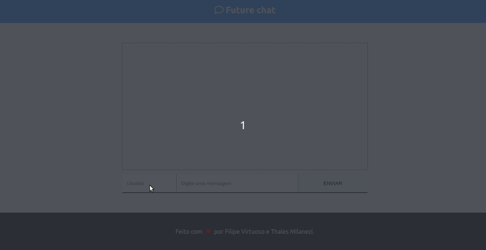

<h1 align="center">
    
     
    FutureTube
</h1>

<h4 align="center">
  Simple website developed during a bootcamp at Future4 in order to practice React.
</h4>

  

  

  

  

  

---

Made with ♥ by Filipe Virtuoso and Thales Milanezi.
